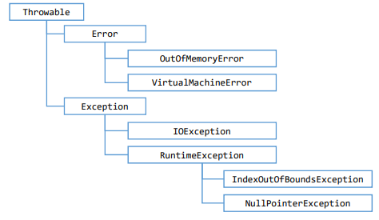

# Exceçoes
- Em java uma exceção é um objeto herdado da class:
  - java.lang.Exception
    - compilador obriga a tratar ou propagar
  - java.lang.RuntimeException
    - compilador não obriga a tratar ou propagar
- Quando lançada é propagada na pilha de chamada de métodos em execução, até que seja capturada (tratada) ou o programa seja encerrado

# Hierarquia de exceções
- https://docs.oracle.com/javase/10/docs/api/java/lang/package-tree.html
- 
- Error
  - não se espera que o programador trate
    - estourou memoria na execução do programa
    - erro na JVM
- Exception
  - exceções que se espera que o programa trate
  - IOException 
    - error de entrada e saida
    - RuntimeException
      - IndexOutOfBoundsException
        - acessar posição do array qeu não exista
      - NullPointerException
        - acessar variavel qeu vale nulo

# Pilha de chamada de metodos (Stack trace)
- Mostra toda a chamada de metodos que acarretou a exceção
```java
catch (ArrayIndexOutOfBoundsException e) {
    e.printStackTrace();
}
```

# Bloco finally
- Bloco de código a ser executado independente de ter exceção
- ex: fechar arquivo, fechar conexão com banco de dados ou outro recurso específico ao final do processamento
```java
try {

} catch (ExceptionType e) {

} finally {

}
```

# throws ParseException
- metodo chamado pode lancar execeção e não precisa tratar ela, podendo propagar a execeção para quem chamar a função

# Exception x RuntimeException
- RuntimeException compilador não obriga a tratar (não precisa try catch)
- Exception compilador obriga a tratar

# throw lança uma execeção
# thwors propaga uma exceção ao invés de trata-la